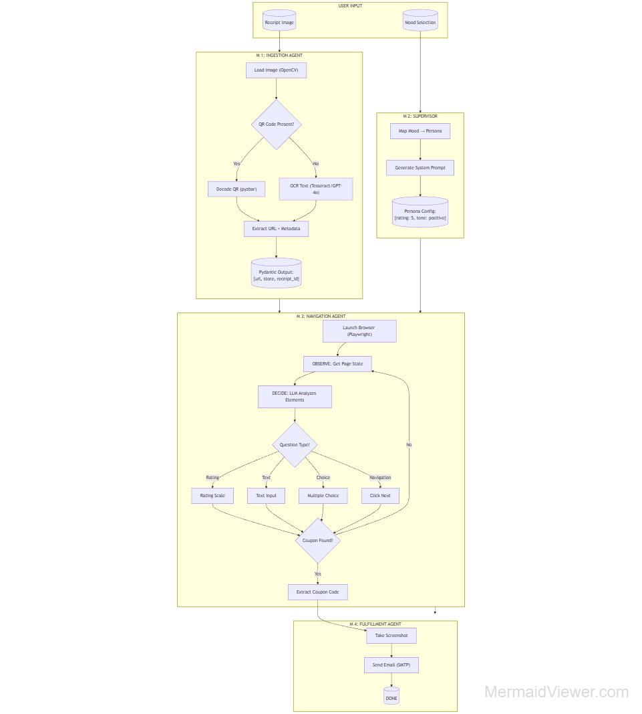
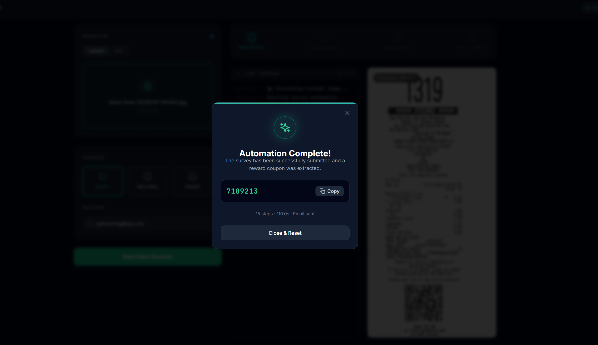

# autoReceipt

An end-to-end automation tool that turns grocery receipts into reward coupons. Upload a receipt photo, and autoReceipt handles the rest: extracting the survey URL, completing the feedback form with AI-generated responses, and delivering the coupon code straight to your inbox.



## Why This Project?

Most fast-food and grocery chains print a survey URL on every receipt, offering a coupon in return for customer feedback. In practice, the surveys are tedious and repetitive, so the vast majority of receipts go to waste along with the rewards they carry.

autoReceipt was built to solve this by exploring several interesting engineering problems at once:

- **Computer vision meets real-world data** -- Receipts are noisy, crumpled, and inconsistently formatted. Reliably extracting a URL from a photo requires combining QR detection, OCR, and LLM-based vision as fallback layers.
- **LLM-driven browser automation** -- Rather than hard-coding selectors for every survey provider, the Navigator agent uses a vision LLM to understand each page and decide what to click or type, making it adaptable to surveys it has never seen before.
- **Multi-agent orchestration** -- The 4-stage pipeline (Ingestion, Supervisor, Navigator, Fulfillment) demonstrates how to decompose a complex task into cooperating agents with clear responsibilities.
- **Full-stack integration** -- From image processing on the backend to real-time SSE progress streaming in the browser, the project covers the full stack in a single cohesive system.

## Features

- **Receipt Processing** -- Extract survey URLs via QR code detection, OCR, or Vision API fallback
- **Persona System** -- Three configurable moods (Happy / Neutral / Angry) that shape survey responses
- **AI Navigation** -- Vision-based (Qwen3-VL) or rule-based survey navigation using Playwright
- **Coupon Extraction** -- Detect validation codes from survey completion pages
- **Email Delivery** -- Send coupons via Formspree or SMTP (Gmail, Outlook, Yahoo)
- **Web UI** -- Two-panel dashboard with live terminal, pipeline stepper, and receipt preview




## Architecture

The system uses a 4-agent pipeline:

| Stage | Agent | Role |
|-------|-------|------|
| 1 | **Ingestion** | Extract survey URL from receipt image (QR / OCR / Vision) |
| 2 | **Supervisor** | Map selected mood to a persona config with rating preferences and tone |
| 3 | **Navigator** | Launch headless browser, analyze pages with LLM, fill forms, advance through survey |
| 4 | **Fulfillment** | Extract coupon code from completion page and deliver it via email |

## Quick Start

### Prerequisites

- Python 3.10+
- [Tesseract OCR](https://github.com/tesseract-ocr/tesseract)
- [Ollama](https://ollama.ai) with `qwen3-vl` model (optional, for vision navigation)

### Installation

```bash
pip install -r requirements.txt
playwright install
```

### Configuration

Create a `.env` file in the project root:

```env
# Email -- pick one method
FORMSPREE_ENDPOINT=https://formspree.io/f/your-form-id
# or SMTP
SMTP_HOST=smtp.gmail.com
SMTP_PORT=587
SMTP_USER=you@gmail.com
SMTP_PASSWORD=your-app-password

# OCR
TESSERACT_CMD=/usr/bin/tesseract

# LLM API keys (optional)
OPENAI_API_KEY=sk-...
ANTHROPIC_API_KEY=sk-ant-...

# Browser
BROWSER_HEADLESS=true
```

See [FORMSPREE_SETUP.md](FORMSPREE_SETUP.md) or [SMTP_SETUP_GUIDE.md](SMTP_SETUP_GUIDE.md) for detailed email configuration.

### Usage

**Web UI** (recommended):

```bash
python run_web.py          # opens http://localhost:5000
python run_web.py --debug  # with hot-reload
```

**CLI:**

```bash
# From receipt image
python -m survey_bot run -i receipt.jpg -m happy -e user@email.com

# Direct URL (skip receipt processing)
python -m survey_bot direct -u https://survey.example.com/abc -m happy -e user@email.com
```

**Windows:**

```bash
run_web.bat
```

## Testing

```bash
pytest tests/ -v                              # unit tests
pytest tests/ -m integration -v               # integration tests
RUN_E2E_TESTS=true pytest tests/test_e2e.py -v  # end-to-end
```

## Project Structure

```
src/survey_bot/
  agents/       # Ingestion, Supervisor, Fulfillment agents + Formspree sender
  browser/      # Playwright launcher, page interactor, observer
  llm/          # LLM chains, navigation graph, vision navigator, prompts
  models/       # Pydantic models (receipt, persona, page state, survey result)
  utils/        # QR decoder, image processing
  web/          # Flask app and HTML templates
  main.py       # SurveyBot orchestrator
```

## License

This project is for personal and educational use.
